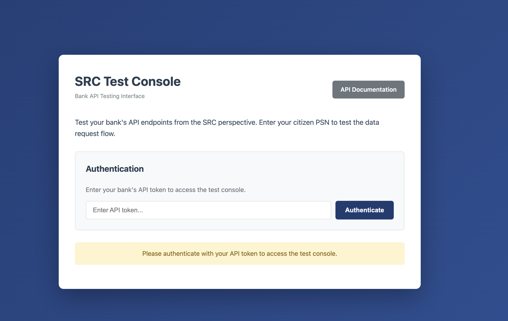
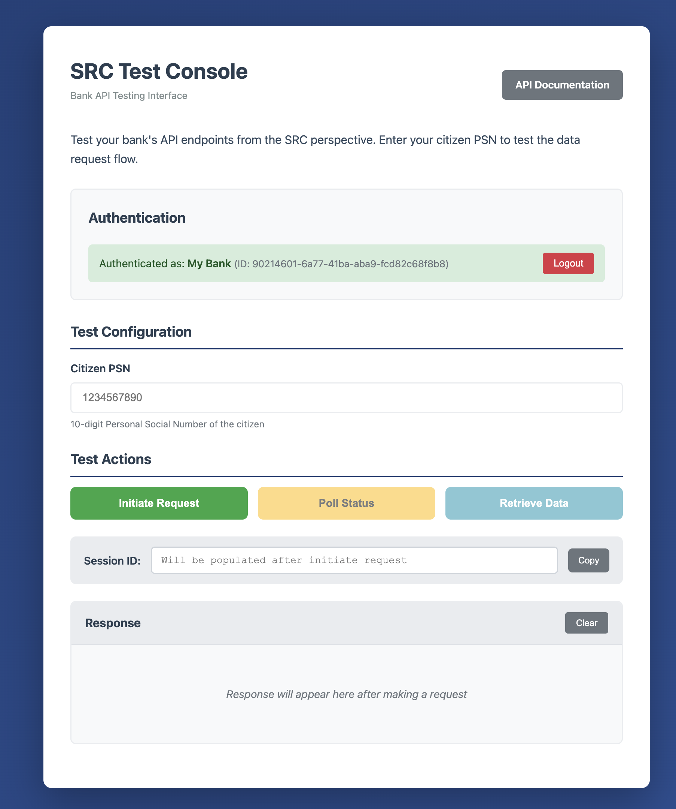
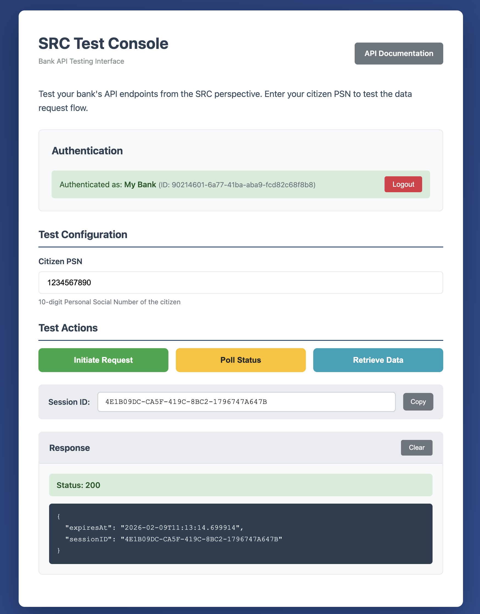
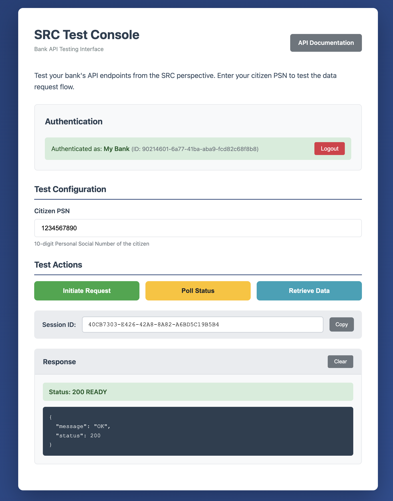
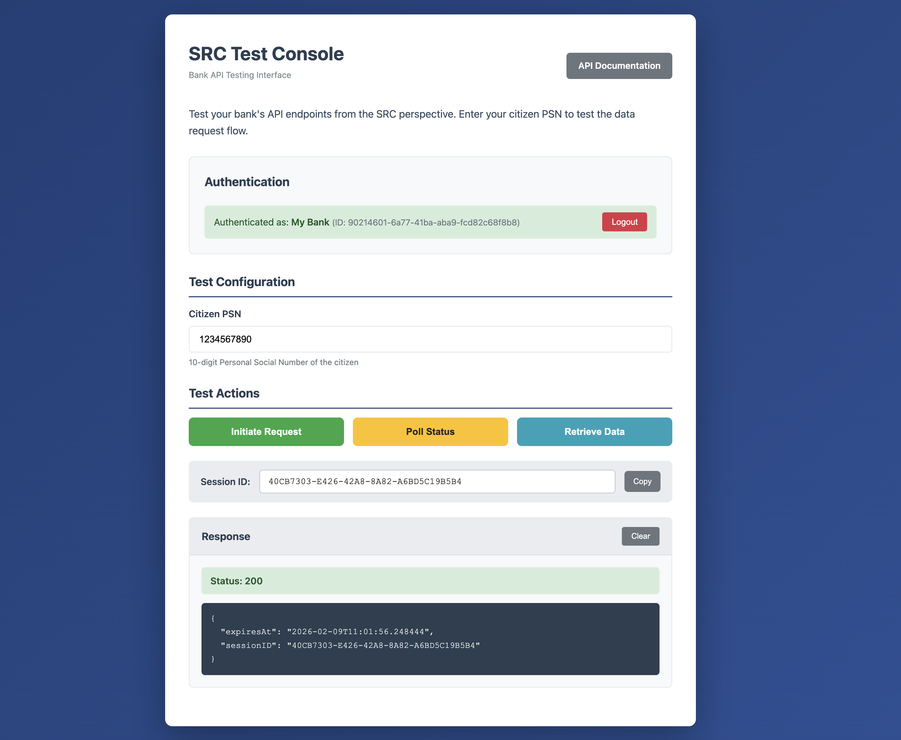

# Usage and Testing Guide

This guide walks you through testing the Bank Data API using the hosted test environment.

## Prerequisites

- Access credentials for the test environment
- A tool to make HTTP requests (browser, curl, or any REST client)

---

## Step 1: Open the Test Declaration App

Go to the test environment in your browser:

**https://test-declaration.isaa.cloud/**



---

## Step 2: Authenticate

Log in with your provided credentials. After successful authentication you will receive a Bearer token to use in subsequent API requests.



---

## Step 3: Initiate a Data Request

Run the initialization request using PSN `1234567890`:

```bash
curl -X GET "https://test-declaration.isaa.cloud/citizen/1234567890/BankingData" \
     -H "Authorization: Bearer <token>" \
     -H "X-Request-ID: 12345678-1234-1234-1234-123456789012"
```

You will receive a response containing a `sessionID`:

```json
{
  "sessionID": "c1a35a20-427b-4492-904f-b91d9359cea1",
  "expiresAt": "2024-01-15T10:30:00Z"
}
```



---

## Step 4: Poll Session Status

Copy the `sessionID` from the previous response and check the session status:

```bash
curl -X GET "https://test-declaration.isaa.cloud/request/{sessionID}" \
     -H "Authorization: Bearer <token>" \
     -H "X-Request-ID: 12345678-1234-1234-1234-123456789012"
```



- **HTTP 200** — Data is ready, proceed to Step 5.
- **HTTP 202** — Still pending, wait a moment and poll again.
- **HTTP 590** — Consent was denied.
- **HTTP 404** — Session expired or not found.

---

## Step 5: Retrieve the Data

Once the status is **READY** (HTTP 200), retrieve the banking data:

```bash
curl -X GET "https://test-declaration.isaa.cloud/citizen/1234567890/BankingData/{sessionID}" \
     -H "Authorization: Bearer <token>" \
     -H "X-Request-ID: 12345678-1234-1234-1234-123456789012"
```



You should see this response:

```json
{
  "DebtSecurityInterest": 0,
  "DepositInterest": 250000,
  "NonPersonifiedIncome": 5640,
  "SecuritiesDeductable": 45000
}
```

---

## Step 6: Run All PSN Tests

If the response for PSN `1234567890` matches the expected output above, proceed to test all other PSNs and compare with the expected results below.

### Expected Responses

| PSN | Expected Behavior | Expected Response |
|-----|-------------------|-------------------|
| `1234567890` | Returns sample banking data | `{"DepositInterest": 250000, "DebtSecurityInterest": 0, "SecuritiesDeductable": 45000, "NonPersonifiedIncome": 5640}` |
| `9876543210` | Returns different banking data | `{"DepositInterest": 180000, "DebtSecurityInterest": 25000, "SecuritiesDeductable": 15000, "NonPersonifiedIncome": 3200}` |
| `5555555555` | Returns all zero values | `{"DepositInterest": 0, "DebtSecurityInterest": 0, "SecuritiesDeductable": 0, "NonPersonifiedIncome": 0}` |
| `1111111111` | Will deny consent | Poll returns **HTTP 590** (DENIED) |
| `3333333333` | Slow processing | Poll returns **HTTP 202** (PENDING) for several seconds before becoming READY |
| `0000000000` | No data available | Initialization returns **HTTP 404** |

For each PSN, repeat Steps 3-5 replacing `1234567890` with the PSN you want to test.

---

## Local Testing

Replace `https://test-declaration.isaa.cloud` with `http://localhost:8080` in all curl commands above to test against a local instance. See the [Setup Guide](SETUP.md) for local installation instructions.

---

## Next Steps

- For full API endpoint details, see the [API Reference](API.md)
- For X-Road integration, see the [X-Road Deployment Guide](XROAD-DEPLOYMENT.md)
