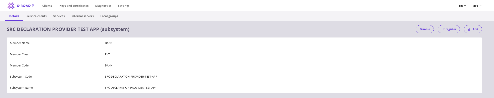

# X-Road Deployment Guide

This guide explains how to deploy the Bank Data API service into X-Road infrastructure.

## Prerequisites

| Requirement | Details |
|-------------|---------|
| X-Road Security Server | Access to your bank's Security Server admin dashboard |
| Registered bank client | Your bank must already be registered as a member/client in X-Road |
| Running Bank Data API | The service from Step 1 must be running and accessible from the Security Server |

---

## 2.1 Access Your Bank Client

1. Go to your Security Server's admin dashboard.
2. Click **Clients** in the navigation menu.
3. Find your bank client in the list.

---

## 2.2 Add Subsystem

1. Click the **Add Subsystem** button.

2. Fill in the fields:

| Field | Value |
|-------|-------|
| Subsystem Code | `SRC-DECLARATION-PROVIDER-TEST-APP` |
| Subsystem Name | `SRC DECLARATION PROVIDER TEST APP` |

3. Click **Add** to create the subsystem.

After adding, you will see the new subsystem listed under your bank client.

---

## 2.3 Add REST Service

1. Click on your newly created subsystem to open the **Subsystem Details** page.

2. Go to the **Services** tab.

3. Click the **Add REST** button.

---

## 2.4 Configure the REST Service

1. In the opened window, fill in:

| Field | Value |
|-------|-------|
| URL Type | Select **OpenAPI 3 Description** |
| Service URL | Your OpenAPI description URL (e.g. `http://<your-ip-or-domain>:8080/openapi.yaml`) |
| Service Code | `BankingData` |

2. Click **Save**.

3. After adding, you will see your service listed (initially disabled).

4. **Enable the service** by clicking the toggle switch to turn it on.

---

## 2.5 Grant Access Rights

1. Click on the **BankingData** service to open its details.
2. Go to the **Access Rights** tab.
3. Disable **TLS certificate**.
4. Click **Save**.

5. Click **Add Subjects**.

---

## 2.6 Search and Select the SRC Consumer Subsystem

1. In the search dialog, fill in the fields to find the SRC subsystem:

| Field | Value |
|-------|-------|
| Instance | `ISAADemo` |
| Member Class | `GOV` |
| Member Code | `SRC` |
| Subsystem Code | `DECLARATION` |

2. Select the **DECLARATION** subsystem from the search results.

3. Click **Add Selected** to grant access.

---

## 2.7 Configure Endpoint Access

1. In the service details, click on the **Endpoints** tab.

2. Click **Add Endpoint** to add endpoint access rules.

3. Configure access for all endpoints:

| Field | Value |
|-------|-------|
| HTTP Method | `ALL` |
| Path | `/**` (wildcard to allow all paths) |

4. Click **Save**.

---

## 2.8 Configure Connection Type

1. Go to the **Internal Servers** tab in your subsystem.

2. Change the **Connection Type** to **HTTP**.

> **Important:** Leave the TLS connection disabled. Enabling it without proper IS certificates will cause an `SslAuthenticationFailed` error. Use HTTP for testing environments. For production, configure proper HTTPS with certificates.

---

## 2.9 Wait for ISAA Approval

At this stage, the ISAA must approve your service registration. Your bank needs to wait until confirmation is received from the central server before proceeding.

---

## 2.10 Verify X-Road Connection

After completing all steps, verify that everything is working:

**Check Service Status:**
- Service should show as enabled (green toggle)
- Access rights should list the SRC consumer subsystem

**Test the Connection:**

Once your X-Road configuration is complete, go to the **SRC Test Console** to verify the connection. Authenticate with your API token and follow the testing flow (Initiate Request, Poll Status, Retrieve Data).

**Check Logs:**
- Security Server logs for incoming requests
- Application logs for processed requests

---

## X-Road Connection Troubleshooting

For any issues related to X-Road connection, please contact us at [x-road@isaa.am](mailto:x-road@isaa.am).

---

## X-Road Setup Checklist

- [ ] Subsystem created under bank client
- [ ] Subsystem registered with Central Server
- [ ] REST service added with correct URL
- [ ] Service enabled (toggle on)
- [ ] Access rights granted to SRC consumer subsystem
- [ ] Endpoints configured (`ALL /**`)
- [ ] Connection type set appropriately (HTTP for testing)
