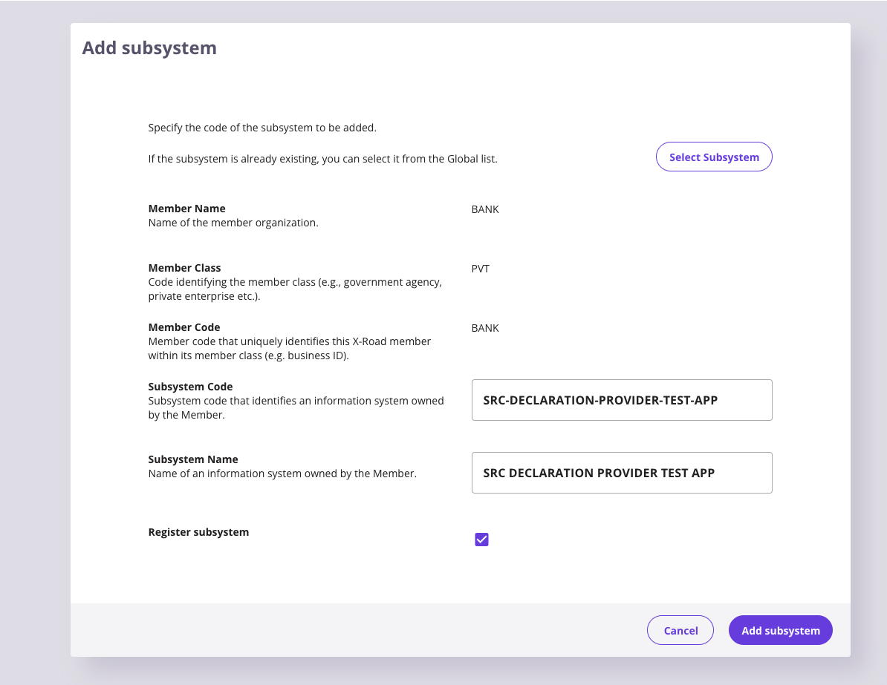
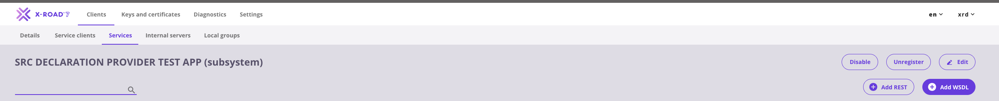
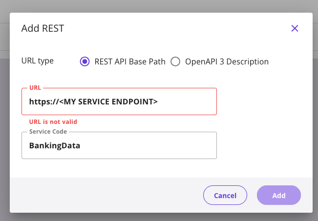
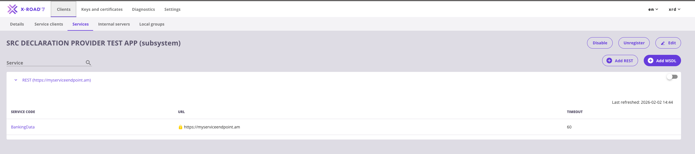
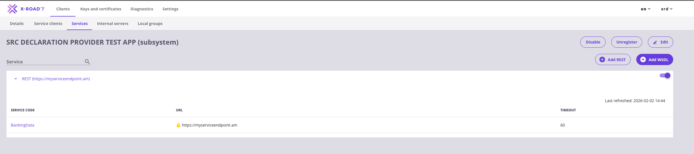
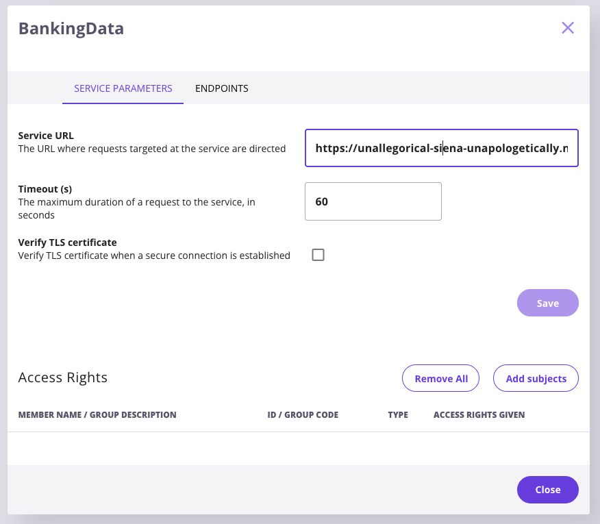
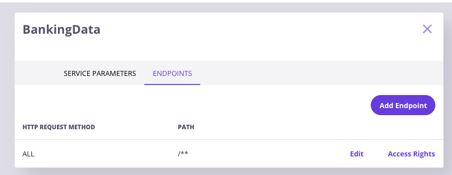
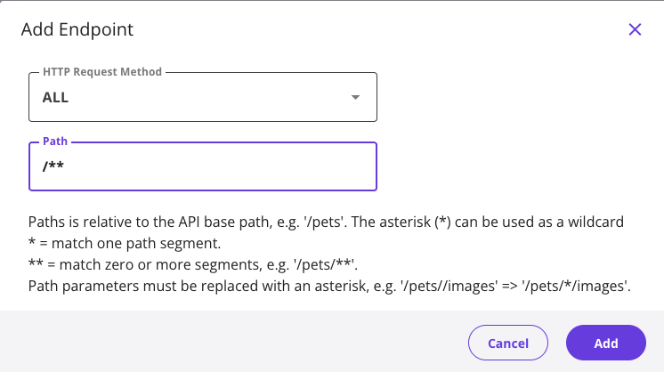
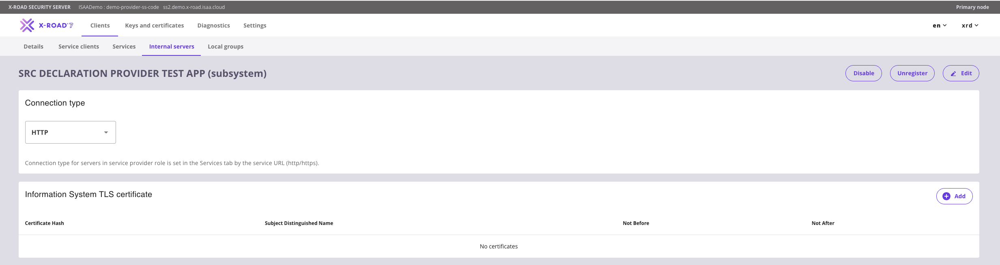

# X-Road Deployment Guide

This guide explains how to deploy the Bank Data API service into X-Road infrastructure.

## Prerequisites

- Access to X-Road Security Server admin dashboard
- Bank client already registered in X-Road
- Bank Data API service running and accessible (see [Setup Guide](SETUP.md))

---

## Step 1: Access Your Bank Client

1. Go to your Security Server's admin dashboard
2. Click **Clients** in the navigation menu
3. Find your bank client in the list


---

## Step 2: Add Subsystem

1. Click the **Add Subsystem** button

2. In the opened window, fill in the fields:
   - **Subsystem Code:** `SRC-DECLARATION-PROVIDER-TEST-APP`
   - **Subsystem Name:** `SRC DECLARATION PROVIDER TEST APP`



3. Click **Add** to create the subsystem

4. After adding, you will see the new subsystem listed under your bank client

---

## Step 3: Add REST Service

1. Click on your newly created subsystem to open the **Subsystem Details** page


2. Go to the **Services** tab

3. Click the **Add REST** button



---

## Step 4: Configure the REST Service

1. In the opened window, fill in:
   - **Service URL:** Your actual service address (e.g., `https://your-ngrok-url.ngrok-free.app` or your public service URL)
   - **Service Code:** `BankingData`



2. Click **Save**

3. After adding, you will see your service listed (initially disabled)



4. **Enable the service** by clicking the toggle switch



---

## Step 5: Grant Access Rights

1. Click on the **BankingData** service to open its details

2. Go to the **Access Rights** tab

3. Click **Add Subjects** button



---

## Step 6: Search and Select Consumer Subsystem

1. In the search dialog, fill in the fields to find the SRC DECLARATION subsystem:
   - **Instance:** Your X-Road instance
   - **Member Class:** (e.g., `GOV`)
   - **Member Code:** Consumer member code
   - **Subsystem Code:** `SRC-DECLARATION` (or your consumer subsystem name)


2. Select the **SRC DECLARATION** subsystem from the search results


3. Click **Add Selected** to grant access

---

## Step 7: Configure Endpoint Access

1. In the service details, click on **Endpoints** tab

2. Click **Add Endpoint** to add endpoint access rules



3. Configure access for all endpoints:
   - **HTTP Method:** `ALL`
   - **Path:** `/**` (wildcard to allow all paths)



4. Click **Save**

---

## Step 8: Configure Connection Type

1. Go to the **Internal Servers** tab in your subsystem

2. Change the **Connection Type** to **HTTP**



> **Note:** Use HTTP for testing environments. For production, configure proper HTTPS with certificates.

---

## Verification

After completing all steps, verify the setup:

1. **Check Service Status:**
   - Service should show as enabled (green toggle)
   - Access rights should list the consumer subsystem

2. **Test X-Road Connection:**
   ```bash
   curl -H "X-Road-Client: INSTANCE/CLASS/MEMBER/SUBSYSTEM" \
        http://your-security-server:8080/r1/INSTANCE/CLASS/MEMBER/YOUR-SUBSYSTEM/BankingData/citizen/1234567890/BankingData
   ```

3. **Check Logs:**
   - Security Server logs for incoming requests
   - Application logs for processed requests

---

## Troubleshooting

### Service Not Found (404)

- Verify the service is enabled
- Check the service URL is correct and accessible
- Ensure endpoints are configured with `/**` wildcard

### Access Denied

- Verify access rights are granted to the consumer subsystem
- Check if the consumer subsystem is registered and active
- Ensure the X-Road-Client header matches the granted subsystem

### Connection Refused

- Verify the service URL is reachable from the Security Server
- Check firewall rules
- For local development, ensure ngrok or similar tunnel is running

### TLS Certificate Errors

- For testing, set Connection Type to HTTP
- For HTTPS, configure proper certificates in Internal Servers

---

## Summary Checklist

- [ ] Subsystem created under bank client
- [ ] Subsystem registered with Central Server
- [ ] REST service added with correct URL
- [ ] Service enabled (toggle on)
- [ ] Access rights granted to consumer subsystem
- [ ] Endpoints configured (`ALL /**`)
- [ ] Connection type set appropriately (HTTP for testing)
